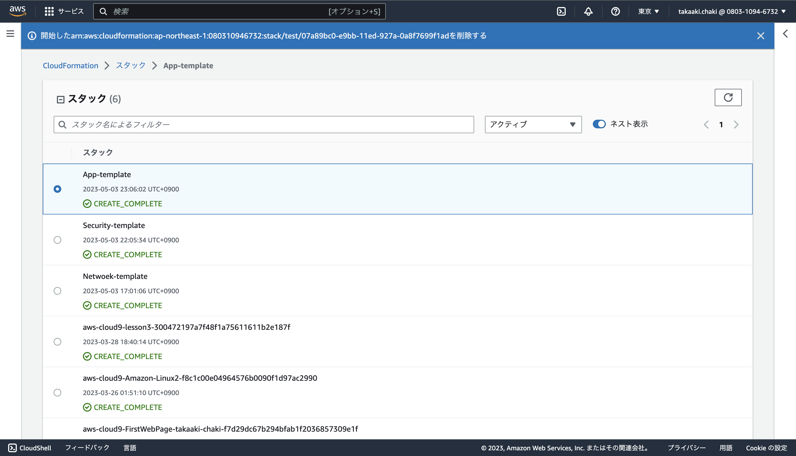
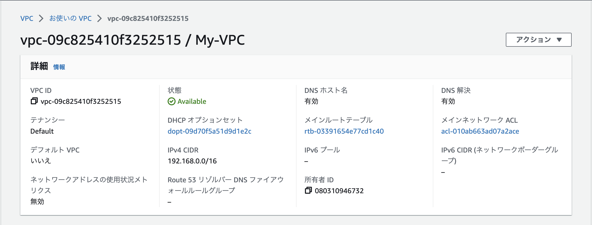
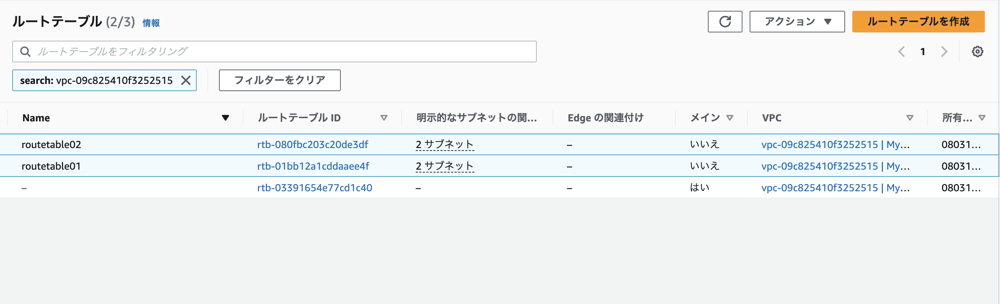
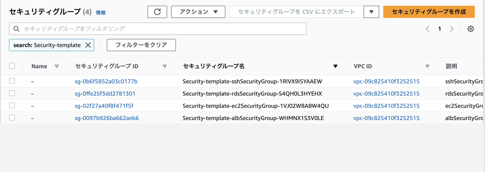
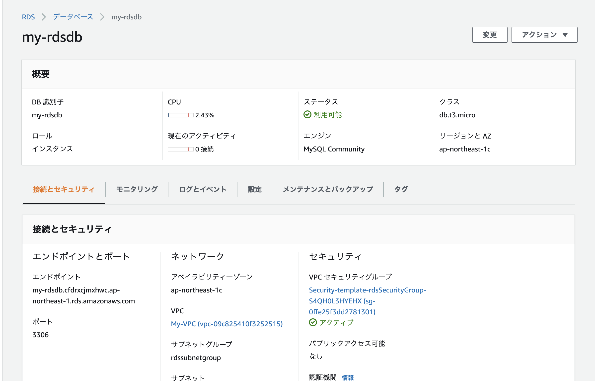
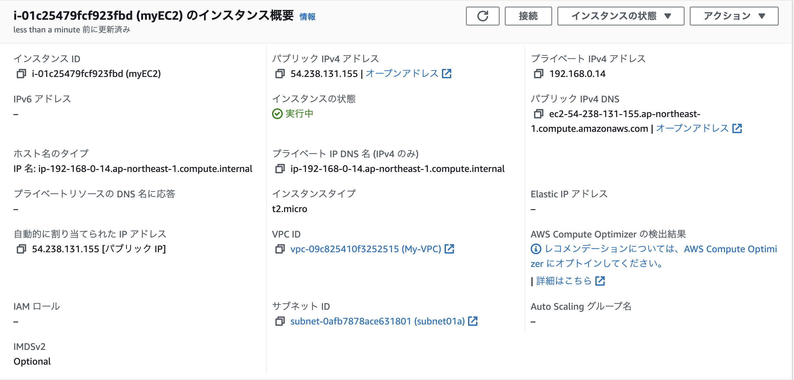
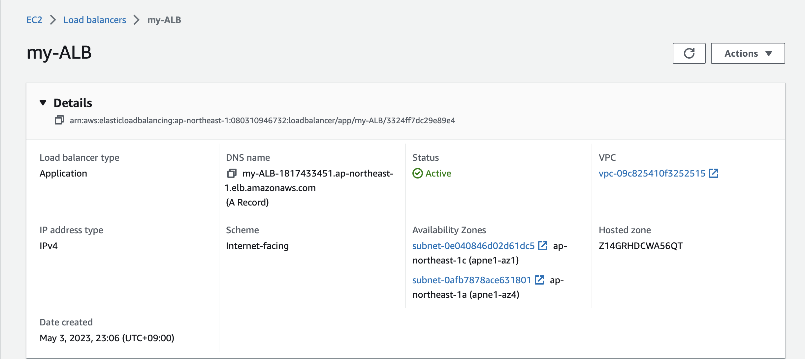
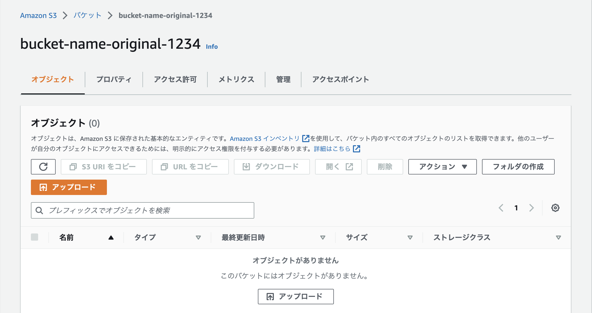

# Lesson10
## CloudFormationを利用して現在までに作った環境のコード化

1. CloudFormation  
  

2. VPC  
  

3. ルートテーブル
  

4. セキュリティグループ
  

5. RDS  
  

6. EC2  
  

7. ALB
  

8. S3  
  

### その他
作成したソースコード格納先  
[Network](../source/Network-properties.yml)  
[Security](../source/Security-properties.yml)  
[Application](../source/App-properties.yml)  