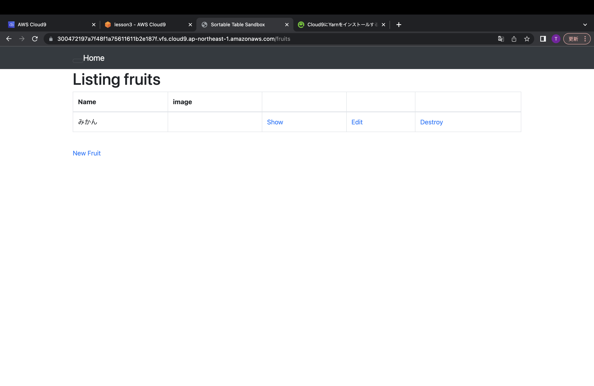
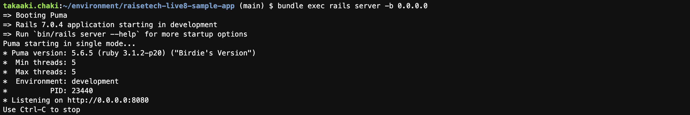
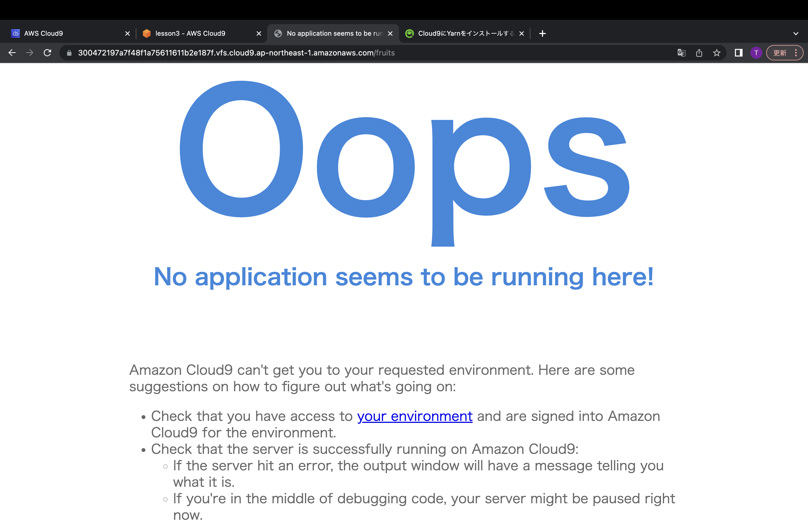
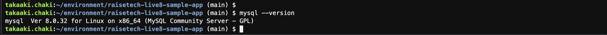
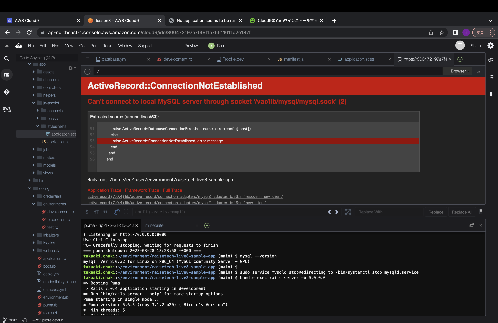

# Lesson3
## AP サーバーについて調べてみましょう。  
AP サーバーの名前とバージョンを確認してみましょう。  
AP サーバーを終了させた場合、引き続きアクセスできますか?結果を確認して、また APサーバーを起動してください。  

## DB サーバーについて調べてみましょう。
サンプルアプリケーションで使った DB サーバー(DB エンジン)の名前と、今 Cloud9 で動作しているバージョンはいくつか確認してみましょう。  
DB サーバーを終了させた場合、引き続きアクセスできますか?  
Rails の構成管理ツールの名前は何でしたか?確認してみてください。 今回の課題から学んだことを報告してください。  
(任意)今回の報告を GitHub の PR で行って、URL を報告してください。

1. アプリケーション起動  

2. APサーバーの名前とバージョンを確認  

3. APサーバー停止後の動作  
　→サーバ停止後はブラウザ上には表示されない  

4. DBサーバ名、バージョンの確認  

5. DBサーバ停止後の動作確認
　→DBサーバ停止後にアプリケーション起動を実施してもエラーが発生し、起動できない  

6. Rails の構成管理ツール
　→Bundler

# 学んだ内容
フレームワークはとても便利でアプリケーションを制作する上では素晴らしいものだと思います。  
実際に、Rnbyの構築は独学で学んだことがあり構築できた時は歓喜極まったのも事実です。  
ですが、現場経験を経て思うことが本当に学ばないといけない場所はフレームワークで作られている  
部分についてだと思っています。
今回制作したデモアプリもエラーが発生しました。
仕組みを理解した上で的確な原因を見つけられるエンジニアになりたいです。