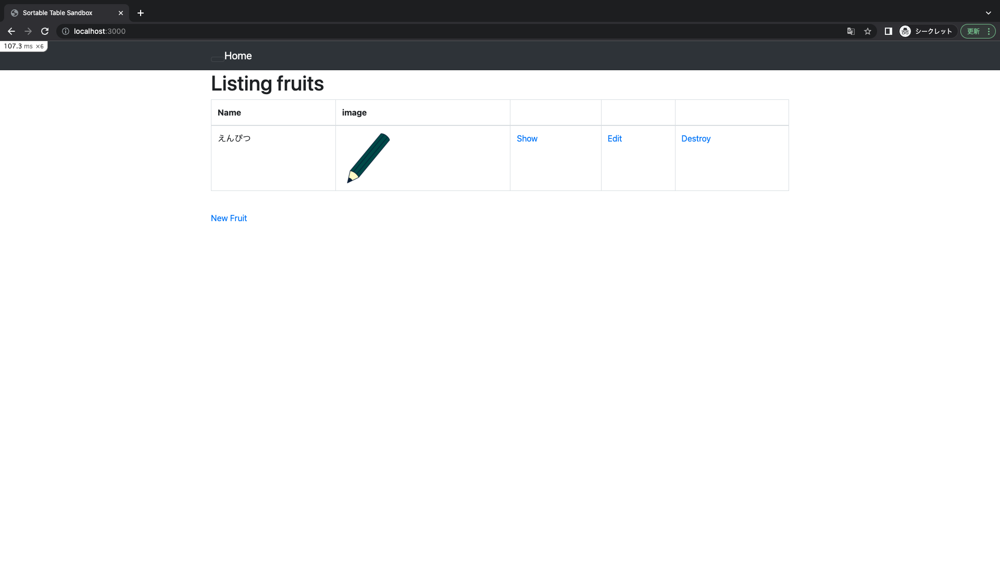
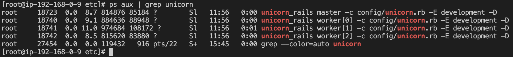
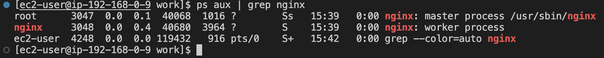
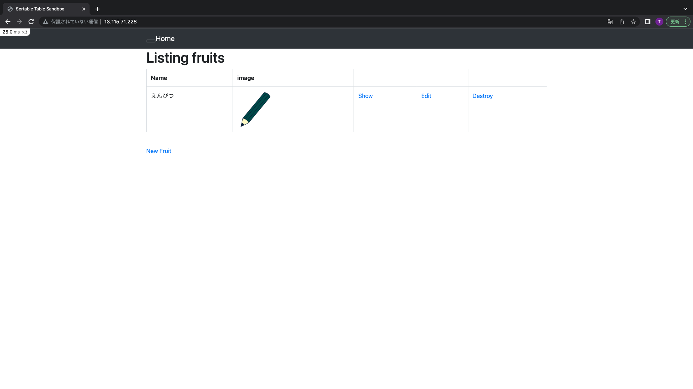
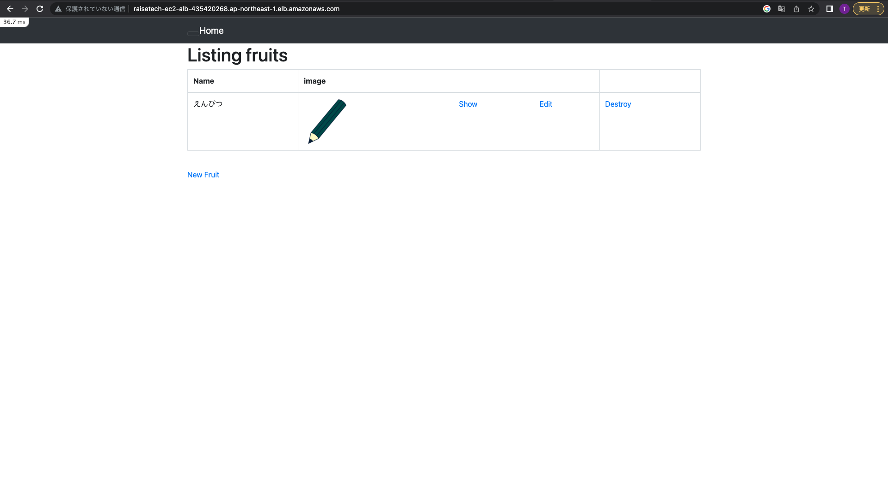
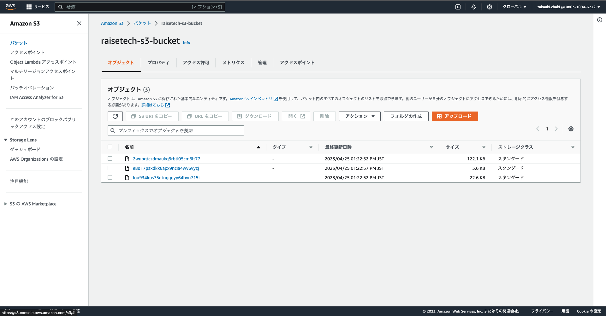
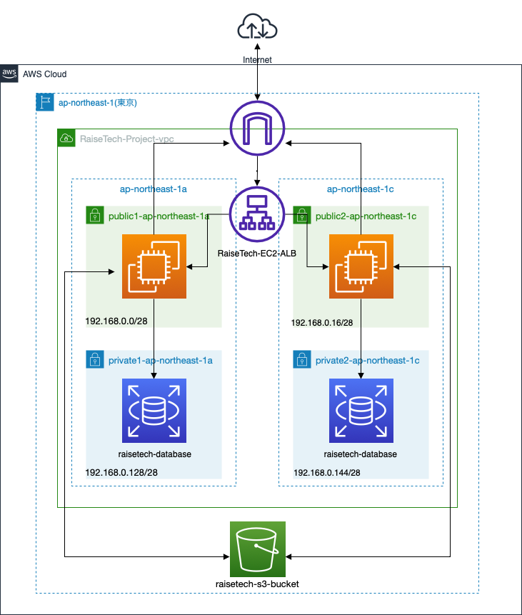

# Lesson5
## EC2環境構築  

1. rails server -b 0.0.0.0　コマンド  
　　→[EC2アプリケーションデプロイ](Construction/EC2.md)  
  

2. Web/APサーバの構築  
　　→[Web/APサーバの構築](Construction/Web・AP.md)  
2.1 Unicorn起動  
  

2.2 Nginx起動  
  

2.3 動作確認  
  

3. ALB構築  
DNS nameでWebサイトにアクセス  
  

4. S3構築  
　　→[S3構築](Construction/S3.md)  
  
  

5. 構成図  
  