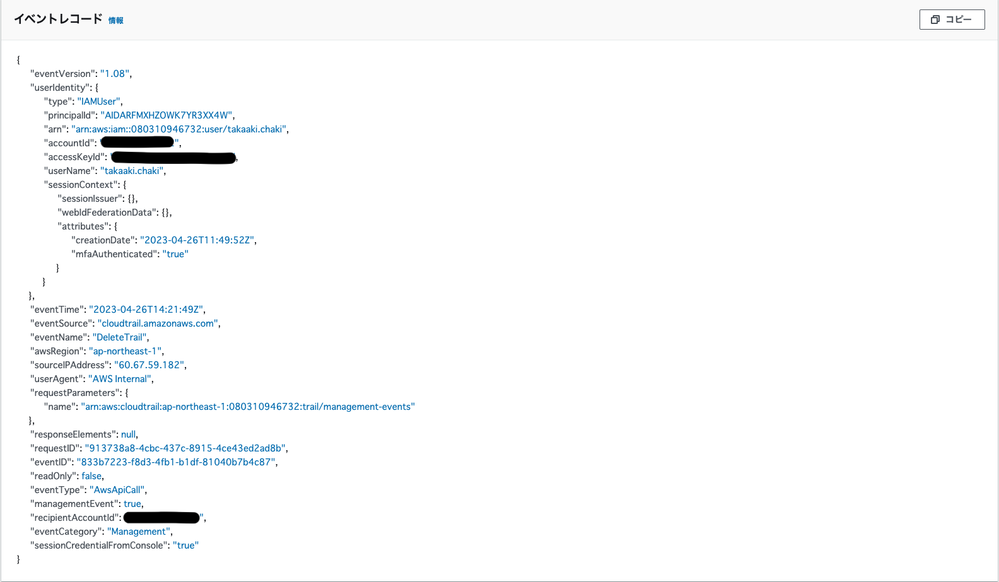
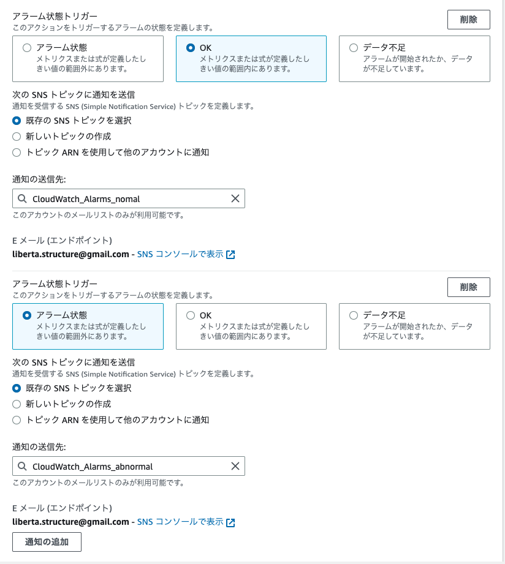
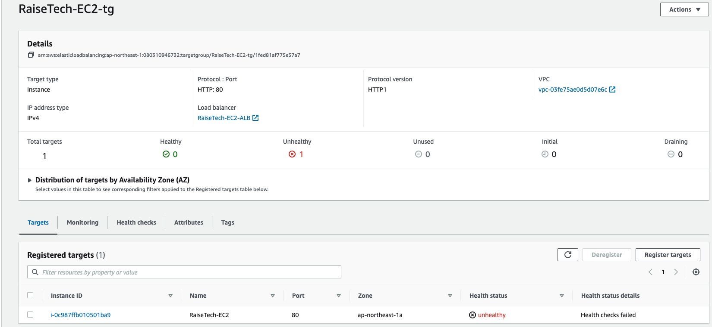
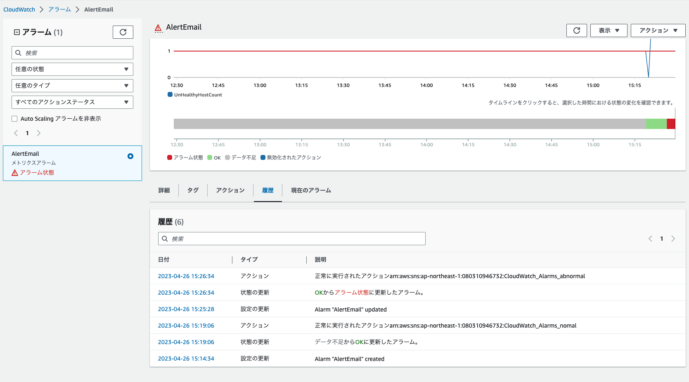
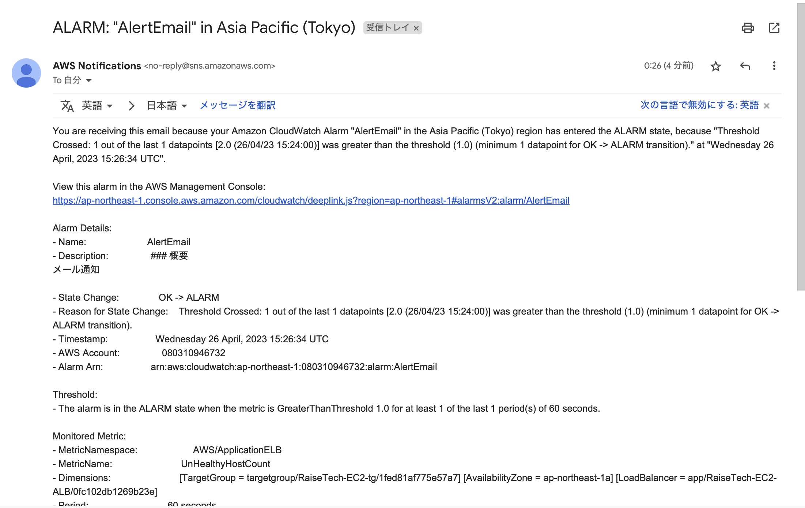
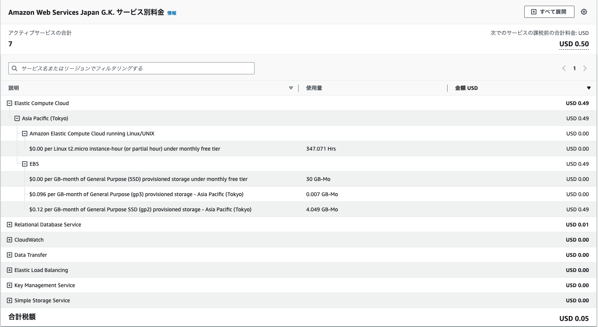
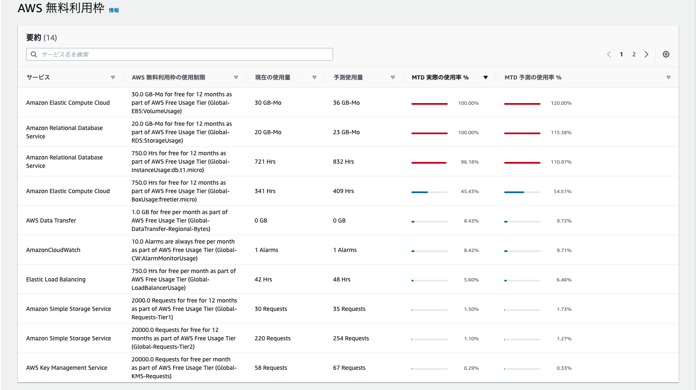

# Lesson6

1. CloudTrailのイベント確認  
  

イベントに含まれていた情報  
• イベント名："DeleteTrail"  
• IPアドレス  
• リージョン  
• 発生時刻  
• ユーザー名  
• アクセスキー  
• 電話番号  

2. CroudWatchでALBのアラーム通知  
2.1 アラーム状態トリガーの設定  
  

2.2 unhealthyになった際のアラーム通知  
  
  

2.3 メール通知  
  

3. AWS利用料の見積作成  
　→[見積書](https://calculator.aws/#/estimate?id=a12e5816fa3073238915089f92c152af22421b10)  

4. 請求情報確認  
4.1 現在の利用料  
  

4.2 AWS利用無料枠  
  
